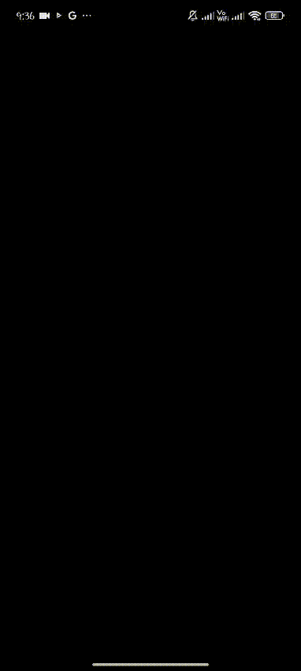
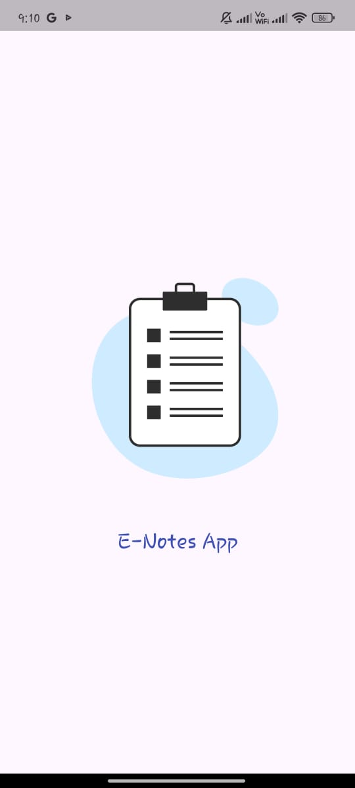
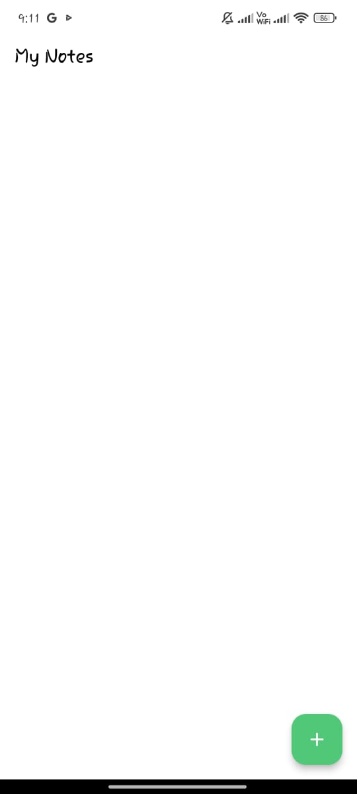
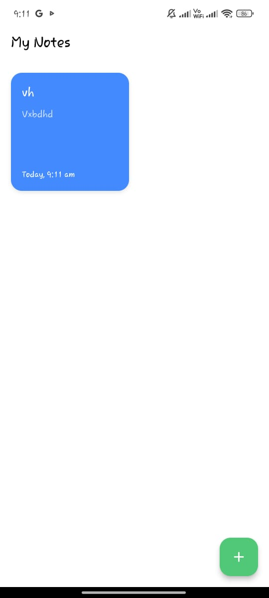

# Notes App with SQLite 📝

A **simple notes application** that stores notes locally using **SQLite**. This project demonstrates a basic CRUD (Create, Read, Update, Delete) functionality with a clean and intuitive user interface. It also includes a **Lottie animation** on the splash screen for a polished user experience.

## 🎬 Splash Screen Animation



---

## 🚀 Features
- **SQLite Database** integration for storing notes locally.
- **Create, Read, Update, and Delete (CRUD)** operations on notes.
- **Search functionality** for quick access to notes.
- **Lottie Animation** for the splash screen experience.
- Clean and **user-friendly UI**.

---

## 📸 Screenshots

| Splash Screen      | Home Screen       | Add Note       | Note Listing    |
|--------------------|-------------------|----------------|-----------------|
|  |  |  |  |

---

## 🛠️ Built With
- **Flutter**  
- **Dart**  
- **SQLite** for local storage  
- **Lottie** for splash screen animations  

---

## 📂 Project Structure
```plaintext
notesapp/
│
├── lib/
│   ├── main.dart           # Entry point of the app
│   ├── models/
│   │   └── note_model.dart # Data model for the notes
│   ├── screens/
│   │   ├── splash_screen.dart # Splash screen with Lottie animation
│   │   ├── home_screen.dart   # Home screen showing all notes
│   │   └── add_note_screen.dart # Screen for adding/editing notes
│   ├── database/
│   │   └── notes_database.dart # SQLite database setup and helper functions
├── assets/                   # App assets (icons, screenshots, animations)
│   ├── splashscreen.jpeg      # Splash screen image
│   ├── homescreen.jpeg        # Home screen image
│   ├── addnotes.jpeg          # Add note screen image
│   ├── homenotes.jpeg         # Note listing screen image
│   └── startup.json           # Lottie animation for splash screen
└── pubspec.yaml              # Project dependencies
```

---

## 🎬 Lottie Animation

The app uses Lottie animations to enhance the splash screen experience. The animation file can be found in the assets directory:

```plaintext
assets/startup.json
```

---

## 🚀 How to Run Locally
1. **Clone** the repository:
   ```bash
   git clone https://github.com/your-username/notesapp-sqlite.git
   cd notesapp-sqlite
   ```

2. **Install dependencies**:
   ```bash
   flutter pub get
   ```

3. **Run the app**:
   ```bash
   flutter run
   ```

---

## 🌟 Future Improvements
- Add **note categorization** for organizing notes.
- Implement **syncing with cloud storage** to back up notes.
- Include **authentication** for secure access to notes.

---

## 🤝 Contributing
Contributions are welcome! Please feel free to submit a **pull request**.

---

## 🛡️ License
This project is licensed under the **MIT License** – see the [LICENSE](LICENSE) file for details.

---

## 📬 Contact
For any questions or suggestions, reach out to me:

- **GitHub**: [obaidullah72](https://github.com/obaidullah72/)
- **LinkedIn**: [obaidullah72](https://www.linkedin.com/in/obaidullah72/)

---

[](https://visitcount.itsvg.in)
